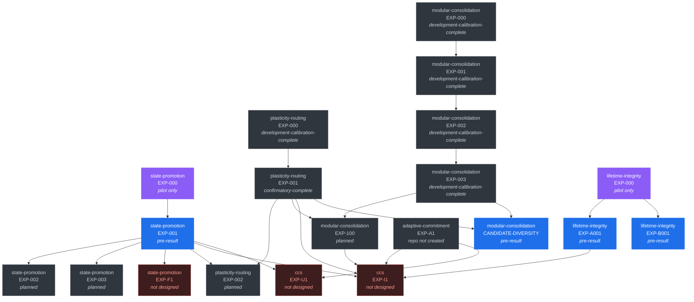

# Experiment dependency DAG

Which experiment must read out before another can be designed or interpreted.

**Source of truth is [`ledger/dag.json`](../ledger/dag.json).** The diagram and
table below are generated by `tools/render.py`.

An edge `A --> B` means: *B should not be run to confirmatory status until A has
read out*, because B's design or its interpretation depends on A's outcome. It is
not a code dependency.

<!-- GENERATED:dag -- do not edit by hand; run tools/render.py -->

Solid nodes exist in code. Dashed nodes have no repository. The red node has no design and no host repository.

| Node | Operator | Stage | Tests | Depends on |
|---|---|---|---|---|
| `state-promotion/EXP-000` | COMMIT_INTERNAL | pilot-complete | — | — |
| `state-promotion/EXP-001` | COMMIT_INTERNAL | pre-result-scaffold | CCS-C2, CCS-C3, CCS-C9, CCS-C10 | `state-promotion/EXP-000` |
| `state-promotion/EXP-002` | COMMIT_INTERNAL | planned | CCS-C2 | `state-promotion/EXP-001` |
| `state-promotion/EXP-003` | COMMIT_INTERNAL | planned | CCS-C2 | `state-promotion/EXP-001` |
| `state-promotion/EXP-F1` | COMMIT_INTERNAL | not-designed | CCS-C5 | `state-promotion/EXP-001` |
| `plasticity-routing/EXP-000` | ALLOCATE | development-calibration-complete | — | — |
| `plasticity-routing/EXP-001` | ALLOCATE | confirmatory-complete | CCS-C4, CCS-C1, CCS-C9 | `plasticity-routing/EXP-000` |
| `plasticity-routing/EXP-002` | ALLOCATE | planned | CCS-C4 | `plasticity-routing/EXP-001`, `state-promotion/EXP-001` |
| `modular-consolidation/EXP-000` | COMMIT_INTERNAL | development-calibration-complete | — | — |
| `modular-consolidation/EXP-001` | COMMIT_INTERNAL | development-calibration-complete | CCS-C6 | `modular-consolidation/EXP-000` |
| `modular-consolidation/EXP-002` | COMMIT_INTERNAL | development-calibration-complete | CCS-C11 | `modular-consolidation/EXP-001` |
| `modular-consolidation/EXP-003` | COMMIT_INTERNAL | development-calibration-complete | CCS-C11 | `modular-consolidation/EXP-002` |
| `modular-consolidation/EXP-100` | COMMIT_INTERNAL | planned | CCS-C6, CCS-C11 | `modular-consolidation/EXP-003`, `plasticity-routing/EXP-001` |
| `lifetime-integrity/EXP-000` | ACCUMULATE | pilot-complete | — | — |
| `lifetime-integrity/EXP-A001` | ACCUMULATE | pre-result-scaffold | CCS-C7 | `lifetime-integrity/EXP-000` |
| `lifetime-integrity/EXP-B001` | ACCUMULATE | pre-result-scaffold | CCS-C7 | `lifetime-integrity/EXP-000` |
| `ccs/EXP-I1` | ALL | not-designed | CCS-C8, CCS-C1 | `state-promotion/EXP-001`, `plasticity-routing/EXP-001`, `adaptive-commitment/EXP-A1`, `modular-consolidation/EXP-100`, `lifetime-integrity/EXP-A001` |
| `adaptive-commitment/EXP-A1` | COMMIT_EXTERNAL | planned | CCS-C1 | — |
| `ccs/EXP-U1` | COMMIT_INTERNAL + COMMIT_EXTERNAL | not-designed | CCS-C12 | `state-promotion/EXP-001`, `adaptive-commitment/EXP-A1` |
| `modular-consolidation/CANDIDATE-DIVERSITY` | COMMIT_INTERNAL | pre-result-scaffold | CCS-C13 | `modular-consolidation/EXP-003`, `plasticity-routing/EXP-001` |

<!-- /GENERATED:dag -->

## The shape of the problem

The graph is no longer a fan-out from one node. Three tracks have run development
work in parallel, and the useful structure is now the pattern of *blocking* edges
between them:

- `plasticity-routing/EXP-002` (language model) is blocked on
  `state-promotion/EXP-001`, so that a shared two-timescale defect is not baked in.
- `modular-consolidation/EXP-100` is blocked on `plasticity-routing/EXP-001`
  freezing the shared LM backbone, adapter family and routing substrate. That
  track notes that the removal of its own upstream blocker is **not** the same as
  the substrate having been chosen.
- `lifetime-integrity` has no experimental dependency on any sibling, but carries
  a `ccs_claim_gate`: its results cannot license a CCS architecture claim until
  `state-promotion` establishes an admissible substrate.

`state-promotion/EXP-001` therefore remains load-bearing, not because everything
waits on it to *run*, but because almost nothing can be *interpreted* as CCS
evidence without it.

**One exception, as of 2026-09-03:** `adaptive-commitment` is not downstream of it
at all. COMMIT_EXTERNAL was deliberately scoped as a separate domain, so that
track could in principle produce the programme's first admissible result without
`state-promotion` reading out. Both `ccs` nodes additionally require the
[resource envelope](RESOURCE-ENVELOPE.md) to be populated before their primary
comparison can even be stated.

### The first frozen protocol — 2026-09-03

`plasticity-routing/EXP-001` is the programme's first node at `protocol-frozen`:
commit, source-tree hash, config hash and a held-out confirmatory seed set all
pinned, with blockers cleared and the seeds unspent. Its own validator refuses a
run that does not match the lock.

A freeze is a statement about *what may be run*, not a result, so it moved no
claim and recorded no evidence. The stage exists precisely so that a freeze can
never be mistaken for a readout — the validator refuses to let a `protocol-frozen`
node carry one.

### Parallelism did not remove the risk

Three tracks ran ahead of the node they depend on. That was reasonable — each
confined itself to literature, benchmark design, preregistration and synthetic
calibration, which is exactly the work that does not depend on the upstream
outcome. But it means the programme now holds a large amount of *inadmissible*
material, and the pressure to treat volume as progress is correspondingly higher.

### One edge was removed at this reconciliation

The umbrella previously had `lifetime-integrity` depending on
`modular-consolidation`. That edge was an umbrella-side assumption.
`modular-consolidation` states there is no dependency in either direction, on the
grounds that long-lifetime coherence and capacity growth are separate failure
classes. The edge is gone.

## Planned and undesigned nodes

`adaptive-commitment/EXP-A1` is the only node whose repository does not exist. Its
question was **rewritten on 2026-09-03**: it is the COMMIT_EXTERNAL track, not a
refinement of `state-promotion`'s consolidation threshold. Its dependency on
`state-promotion/EXP-001` was removed at the same time — that track was
deliberately scoped as a separate domain and is not gated on the state pipeline.

`state-promotion/EXP-F1` is an **umbrella-side candidate**, not that track's
roadmap. It exists so the re-scoped CCS-C5 retains a mapped experiment rather than
floating untestable. If `state-promotion` declines it, the correct action is to
retire CCS-C5, not to reassign it a second time.

`ccs/EXP-U1` — the unification test for CCS-C12 — has no host repository and no
design, for the structural reason that no track implements both commitment
domains. It is listed so the unification hypothesis stays visible as a claim
rather than dissolving back into vocabulary.

`ccs/EXP-I1` — the integration experiment the synthesis paper would rest on — has
no host repository and no design, **by decision**. A dedicated integration
repository becomes justified only once enough component mechanisms have
admissible evidence to specify a non-arbitrary composition test; designing it now
would bake unsupported component choices into the synthesis programme. Its edges
point at confirmatory nodes, not at the development calibrations that currently
exist. It appears in the graph so the missing prerequisite stays visible.

## Maintaining the graph

`tools/validate_ledger.py` enforces that edges reference real nodes, that the
graph is acyclic, that no node in a non-existent repository carries a readout,
and that any node with a readout states whether that readout is admissible.
