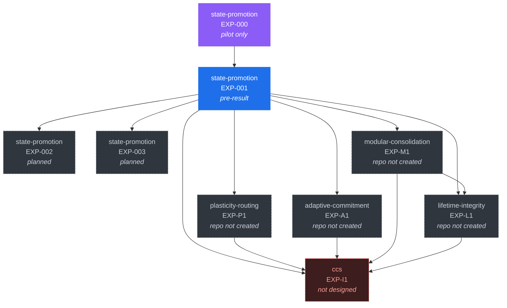

# Experiment dependency DAG

Which experiment must read out before another can be designed or interpreted.

**Source of truth is [`ledger/dag.json`](../ledger/dag.json).** The diagram and
table below are generated by `tools/render.py`.

An edge `A --> B` means: *B should not be run to confirmatory status until A has
read out*, because B's design or its interpretation depends on A's outcome. It is
not a code dependency.

<!-- GENERATED:dag -- do not edit by hand; run tools/render.py -->

Solid nodes exist in code. Dashed nodes have no repository. The red node has no design and no host repository.

| Node | Operator | Stage | Tests | Depends on |
|---|---|---|---|---|
| `state-promotion/EXP-000` | COMMIT | pilot-complete | — | — |
| `state-promotion/EXP-001` | COMMIT | pre-result-scaffold | CCS-C2, CCS-C3, CCS-C9, CCS-C10 | `state-promotion/EXP-000` |
| `state-promotion/EXP-002` | COMMIT | planned | CCS-C2 | `state-promotion/EXP-001` |
| `state-promotion/EXP-003` | COMMIT | planned | CCS-C2 | `state-promotion/EXP-001` |
| `plasticity-routing/EXP-P1` | ALLOCATE | planned | CCS-C4, CCS-C1, CCS-C9 | `state-promotion/EXP-001` |
| `adaptive-commitment/EXP-A1` | COMMIT | planned | CCS-C5, CCS-C1 | `state-promotion/EXP-001` |
| `modular-consolidation/EXP-M1` | COMMIT | planned | CCS-C6 | `state-promotion/EXP-001` |
| `lifetime-integrity/EXP-L1` | ACCUMULATE | planned | CCS-C7 | `state-promotion/EXP-001`, `modular-consolidation/EXP-M1` |
| `ccs/EXP-I1` | ALL | not-designed | CCS-C8, CCS-C1 | `state-promotion/EXP-001`, `plasticity-routing/EXP-P1`, `adaptive-commitment/EXP-A1`, `modular-consolidation/EXP-M1`, `lifetime-integrity/EXP-L1` |

<!-- /GENERATED:dag -->

## The shape of the problem

The graph is a fan-out from a single node. `state-promotion/EXP-001` is the only
experiment in the programme that is implemented, budget-controlled, and capable
of reading out. Everything else is downstream of it or does not exist.

This has two consequences worth stating plainly:

1. **The programme has one point of failure.** If EXP-001 is falsified under valid
   conditions, four of the five planned repositories lose their motivating premise
   — not their subject matter, but their reason to be built in this programme's
   framing. See [FAILURE-CRITERIA.md](FAILURE-CRITERIA.md).
2. **Parallelising is tempting and mostly wrong.** Creating `plasticity-routing`
   or `adaptive-commitment` before EXP-001 reads out would produce experiments
   designed against an untested premise. The dependency edges exist to make that
   cost visible.

## Planned nodes are not scheduled work

Four repositories in this graph do not exist. Their nodes carry a question and a
design hazard, and nothing else. They deliberately have no protocol, no metric
list, and no baselines, because designing those before the upstream readout would
be designing against an assumption.

`ccs/EXP-I1` — the integration experiment the synthesis paper would rest on — has
no host repository and no design at all. It appears in the graph so that the
synthesis paper's missing prerequisite is visible rather than implicit. If it is
ever built it needs its own repository: this umbrella must not become an
implementation repo.

## Maintaining the graph

`tools/validate_ledger.py` enforces that edges reference real nodes, that the
graph is acyclic, that no node in a non-existent repository carries a readout,
and that any node with a readout states whether that readout is admissible.
